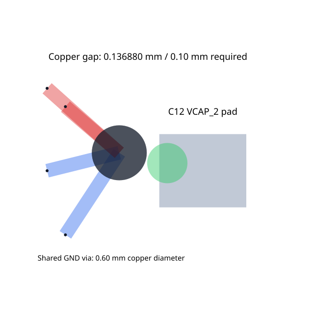

# Shared ground via remains too close to a foreign pad

## Reproduce

```sh
bun install --no-save
bun test tests/shared-via-pad-clearance.test.ts
```

The [repro PR](https://github.com/tscircuit/high-density-repair03/pull/165)
deliberately asserts the observed failure. The stacked fix changes the assertion
to require zero errors and at least 0.10 mm clearance. It runs the real repair solver with two same-root routes sharing
one through-via beside an unrelated rectangular pad. No mocked DRC is used.



## Expected and actual

The 0.60 mm via must have at least 0.10 mm copper clearance from the
0.95 × 0.80 mm pad. Both ground routes must remain attached to the same via,
and their terminal positions must stay fixed.

On baseline `4987f52e782102e31c4bff7dc49fccb3a258a887`, the solver finishes
with one DRC error and leaves a 0.000001 mm copper gap. The numeric geometry
assertion independently verifies the defect. The two route representations
remain colocated, but the via does not move away from the pad.

The dark circle is the via copper, the gray rectangle is the foreign pad,
and the error marker changes from purple to green when repaired. Blue segments
are top-layer copper and red segments are bottom-layer copper. This is an actual solver render;
schematic output is unaffected by this repair-only change.

## Origin and reduction

This was found on a 90 × 55 mm STM32F407VGT6 board with a 16-bit LCD bus and
three explicit autorouting phases: LCD bus lanes, support/power, and MCU data
fanout. The support phase used `beta_pipeline7`. All three original cold builds
using tscircuit 0.0.2764 / capacity-autorouter 0.0.958 left a ground via at
(-30.775001, 13.841451906949) mm beside C12.pin1 on VCAP_2, centered at
(-30, 13.675) mm. Full-board DRC rejected that result.

The same location reproduces when replaying the captured support-phase input
on autorouter commit `9336cd949fb478669628d74620bfc4135c9ff087`. Two point-pair
routes share this physical via. The reduced test translates C12 to the origin,
preserves the measured pad/via geometry, and replaces the long ground routes
with four short legs. Phase scheduling and the LCD bus are not needed to
trigger the isolated repair failure; their geometry is intentionally omitted.

## Cause

The via-to-pad error path in `applyDrcErrorForces` calls
`moveViaAwayFromPoint`, which calls `moveVia`. That helper rejects any site
where `getSameRootViaSite(...).length > 1`. Moving only one representation
would disconnect the shared via, but refusing to move either leaves a
repairable clearance error unresolved. The existing
`translateSameRootViaSite` helper already moves all representations together
and rejects a site containing an immovable member.

The full-board bitmap short report is resolution-dependent: the original
geometric gap is positive, not an overlap. The failing 0.10 mm clearance rule
is sufficient evidence of the bug.

## Fix and validation

Change the one call in `moveViaAwayFromPoint` to `translateSameRootViaSite`.
This reuses the existing movement, board-boundary, and immovable-member checks.
The reduced case has 0.136879563 mm clearance after repair, zero DRC errors,
coincident via copies, and unchanged terminals. A separate test verifies that
a site with one fixed terminal remains fixed. The updated regression fails on
the repro implementation and passes with the one-line fix.

Replaying the original captured support-phase input with the same one-line
dependency change moves both ground-via representations to
(-30.911879563, 13.870850189) mm. C12 clearance becomes 0.136879563 mm and its
via-pad error disappears. This is a targeted phase replay, not a claim that
every other clearance in the complete board has been fixed.

Benchmarks ran locally on an Apple M5, macOS 26.5.1, Bun 1.3.14. Each complete
dataset ran in baseline/fix/fix/baseline order, serially with concurrency 1
and effort 1. SRJ18 uses its captured 16-iteration budget; DRC14 uses its
default iteration budget. Times are means of the two summed solver-time
measurements, excluding worker startup. Both runs agree on every case's DRC count.

| Dataset | Cases | Remaining DRC, baseline → fix | Mean solve time, baseline → fix |
| --- | ---: | ---: | ---: |
| SRJ18 | 16 | 968 → 960 | 13.582 s → 13.485 s |
| DRC14 | 44 | 4 → 4 | 3.426 s → 3.376 s |

SRJ18 sample006 improves from 290 to 282 errors; all other per-case counts
remain unchanged. All 60 cases complete; this does not mean all are DRC-clean.
The small timing differences are not evidence of a speed improvement.

```sh
bun scripts/benchmark.ts --dataset srj18 --limit all --concurrency 1 --out srj18.json
bun scripts/benchmark.ts --dataset drc14 --limit all --concurrency 1 --out drc14.json
```

Focused tests, typecheck, touched-file formatting, and `bun run build:site`
pass. The full suite has 105 passes and one pre-existing failure in
`broad-repulsion-contact-ties.test.ts`, also present before the fix
(104 passes / one failure). No unrelated snapshots are updated.
