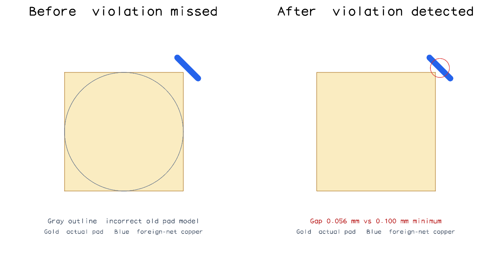
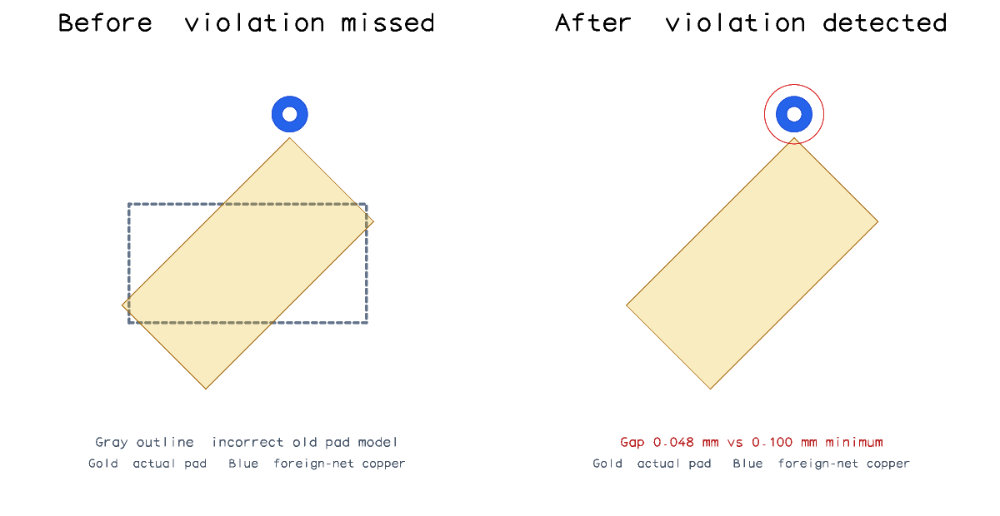
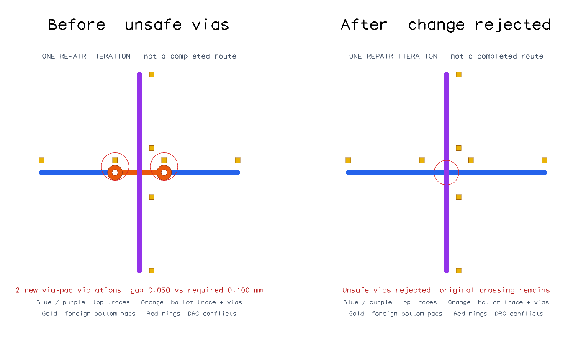

# Pad geometry and via-safety regression snapshots

These examples exercise the **post-routing DRC repair stage**, not initial
route planning. They demonstrate detection and candidate acceptance; they do
not claim that an entire board or benchmark is DRC-clean.

## Square pad corner



The physical copper and trace are identical in both panels. Previously, the
checker treated this explicitly rectangular plated pad as a circle (gray
outline), missing its corner. The corrected checker reports the actual
**0.056 mm** trace-to-pad gap, below the **0.100 mm** minimum.

## Rotated pad and via



Again, the copper does not move. The old checker ignored the pad's 45-degree
rotation (gray outline). The corrected checker reports the **0.048 mm**
via-to-pad gap against the same **0.100 mm** minimum.

Both missed detections were verified by running the same physical inputs on
base commit `c16f524607897f78773f51cb0ca1cc94b15f3d6c`. The snapshot test keeps
explicit legacy-shape controls and asserts the corrected engine's measured
clearances; it does not embed a second copy of the old DRC engine.

## Unsafe layer-change candidate



This comparison is limited to **one repair iteration**. The old solver accepts
a layer change that removes a trace crossing but introduces two vias too close
to foreign pads. The corrected solver rejects that unsafe change. The original
crossing still needs a valid repair; this is a safety demonstration, not a claim
of successful routing.

## Regeneration

```sh
BUN_UPDATE_SNAPSHOTS=1 bun test --timeout 9999999 tests/pad-geometry-snapshots.test.ts tests/repair-via-safety-snapshot.test.ts
```

This regenerates the SVG snapshots and PNG previews. Normal tests compare the
SVGs exactly and assert the underlying DRC measurements. The PNGs are provided
for review, not used as platform-dependent pixel assertions.

The separate `mixed-via-pad-worst-contact-score.test.ts` covers the numerical
scoring fix: partial overlap improvements retain their quantitative score when
via-to-pad errors also exist. It is not a geometric before/after route change.
