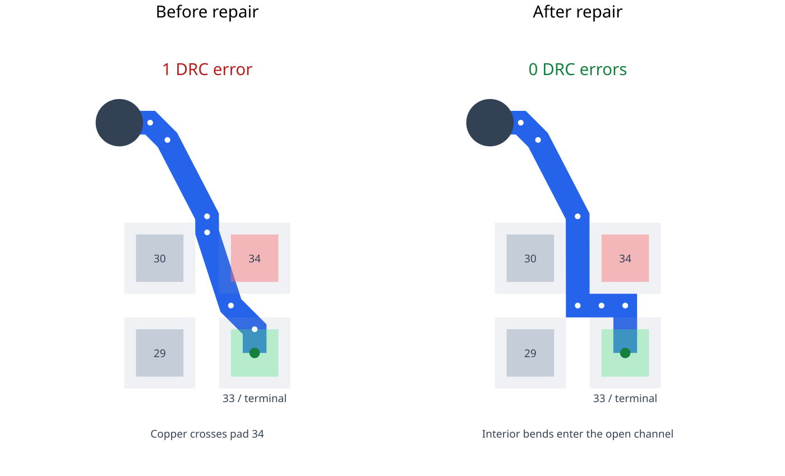

This is a reduced capture of pedometer v1.0.6 immediately before Pipeline9's
joint DRC repair stage.

Source: https://tscircuit.com/seveibar/pedometer?version=1.0.6#pcb

The route geometry is unchanged from the capture. The fixture retains
`source_trace_44`, its connection, the BGA component's pads, and its terminal
pads. Unrelated routes and obstacles are omitted; obstacle connectivity aliases
are reduced to pad identity, net identity, and the relevant route/port aliases.

The trace crosses `pcb_smtpad_34` with about -0.019 mm clearance against a
required 0.05 mm. The shared repair moves the interior bends into the channel
between pads, leaving the terminal positions and vias unchanged.

## Visual reproduction

Run `bun install` and `bun start`, then select `pedometer-bga-pad-escape` in
React Cosmos to pan and zoom the before/after views. Both views use the same
scale and show the final top-layer span from the fixed via to terminal pad 33.
The repair and DRC evaluation still use the complete captured route and all
21 captured pads, not just the displayed close-up.

Blue is the actual 0.10 mm trace width; translucent pad overlays keep copper
crossings visible. Red marks pad 34, green marks terminal pad 33, and pale gray
marks the 0.05 mm trace-to-pad clearance envelope. White dots mark interior
bends. The via and terminal stay fixed as the middle bends enter the channel.

Run `bun test tests/pedometer-bga-pad-escape.test.ts` to verify the one-error
input, zero-error repair, fixed endpoints/vias, unchanged input, and exact SVG
snapshot. Regenerate the snapshot intentionally with:

```sh
BUN_UPDATE_SNAPSHOTS=1 bun test tests/pedometer-bga-pad-escape.test.ts
```


